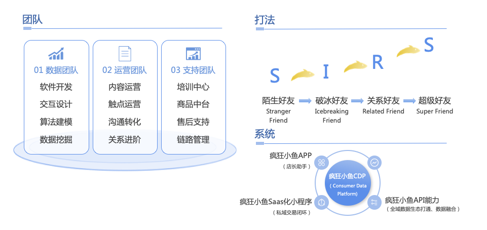
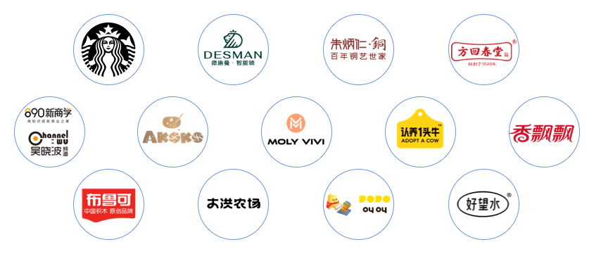
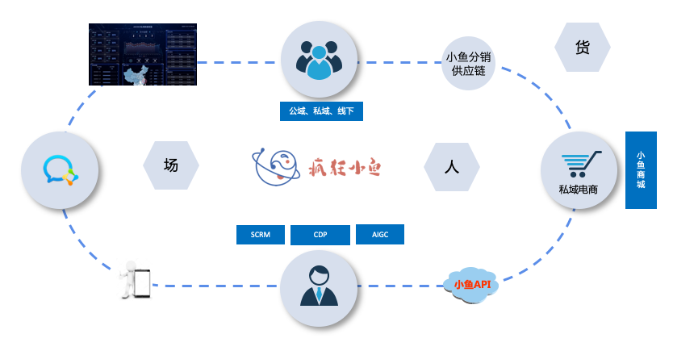
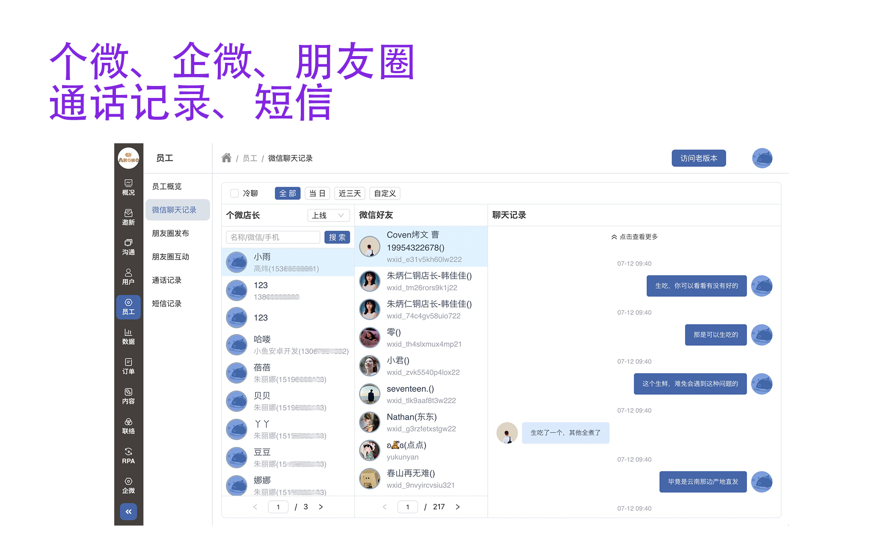

# 疯狂小鱼私域电商平台

疯狂小鱼是国内最早的关系型私域的提出者、倡导者与建设者，致力于成为最有价值的关系型私域综合服务商。

疯狂小鱼为实现品牌与用户的关系加深、单客价值持续提升，疯狂小鱼产品套装包含SCRM、CDP、小程序商城、店长助手APP、GPT企业文案模型、AIGC创作平台、RPA套件等工具，完成了
关系型私域的IT系统建设，为品牌沉淀更有价值的用户数字资产，提供了完善的数字设施。

疯狂小鱼正式商业化以来，得到一批头部消费品牌的高度信任和托付。公司将继续秉承“真诚融合、共信共赢”的核心价值观，与合作品牌一起稳健增长、穿越周期，使生意变得不再焦虑。

## 疯狂小鱼的核心能力

疯狂小鱼认为，私域是关系电商，是时间的朋友；无关系、不生意；只有关系进阶，高位LTV才能持续。

## 疯狂小鱼的关键客户

## 疯狂小鱼产品特点

下一代的SCRM营销助手：任务编排+店长关怀+AI辅助=有温度的服务和营销

## 疯狂小鱼的产品

### 1.SCRM系统

### 2.超级店长APP

### 3.微商城

### 4.RPA套件

### 5.AIGC工具

### 6.数据驾驶舱

## 核心功能

### 1.工作手机聊天记录分析

微信聊天记录、自己发布的朋友圈、点赞回复的好友朋友圈、通话记录、短信记录上传服务器保存，用于后续分析话术培养金牌店长，同时可以监控客服使用不当言论造成损失。

### 2.用户画像

自定义企业用户画像：好友信息类型设置、好友阶段生命周期定义、好友标签、订单标签、好友转介绍...

### 3.人群包

全维度筛选用户：支持不同维度联合筛选，支持用户属性和用户行为联合筛选。

每日更新人群包：可以设置一次性人群包、或者每日更新人群包。

### 4.订单绩效管理

订单管理、绩效管理：小鱼商城私域订单、电商平台全域订单、全域数据对接、订单认领、员工绩效

## 疯狂小鱼产品演示视频

[01.疯狂小鱼店长APP使用说明](https://player.bilibili.com/player.html?isOutside=true&aid=114630043111939&bvid=BV1RNTxz8EpS&cid=30333406247&p=1)

[02.疯狂小鱼后台页面演示](https://player.bilibili.com/player.html?isOutside=true&aid=114630160618502&bvid=BV1TETxzQEot&cid=30333931447&p=1)

## 疯狂小鱼产品功能清单

[01.疯狂小鱼微商城后台功能清单](01.%E7%96%AF%E7%8B%82%E5%B0%8F%E9%B1%BC%E5%BE%AE%E5%95%86%E5%9F%8E%E5%90%8E%E5%8F%B0%E5%8A%9F%E8%83%BD%E6%B8%85%E5%8D%95.md)

[02.疯狂小鱼私域管理后台功能清单](02.%E7%96%AF%E7%8B%82%E5%B0%8F%E9%B1%BC%E7%A7%81%E5%9F%9F%E7%AE%A1%E7%90%86%E5%90%8E%E5%8F%B0%E5%8A%9F%E8%83%BD%E6%B8%85%E5%8D%95.md)

[03.疯狂小鱼私域APP功能清单](03.%E7%96%AF%E7%8B%82%E5%B0%8F%E9%B1%BC%E7%A7%81%E5%9F%9FAPP%E5%8A%9F%E8%83%BD%E6%B8%85%E5%8D%95.md)

## 部署环境

kubernetes、ceph、nas、minio、mysql8 innoDB cluster、postgresql、redis、es7、rocketmq

## 疯狂小鱼产品提供源代码授权和全套k8s部署脚本

平台适合企业内部业务场景的二次开发，微信联系我详谈

